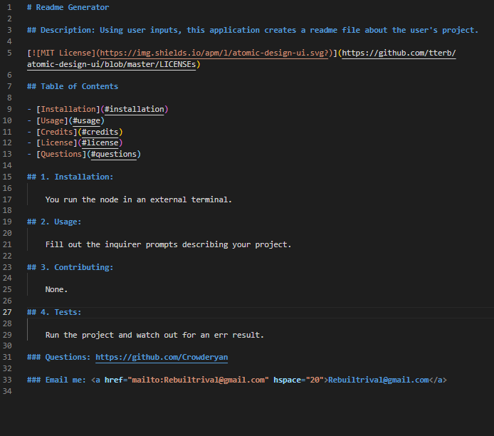
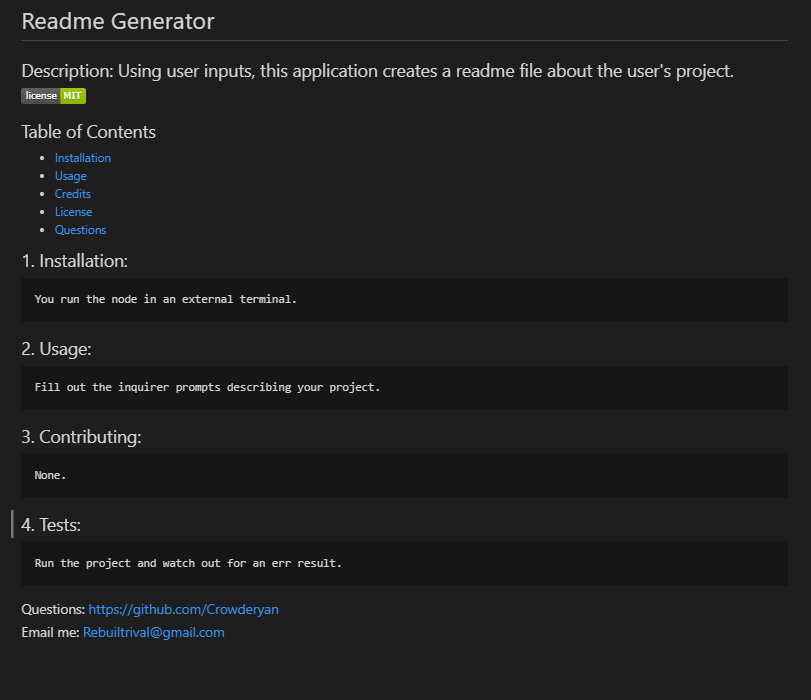
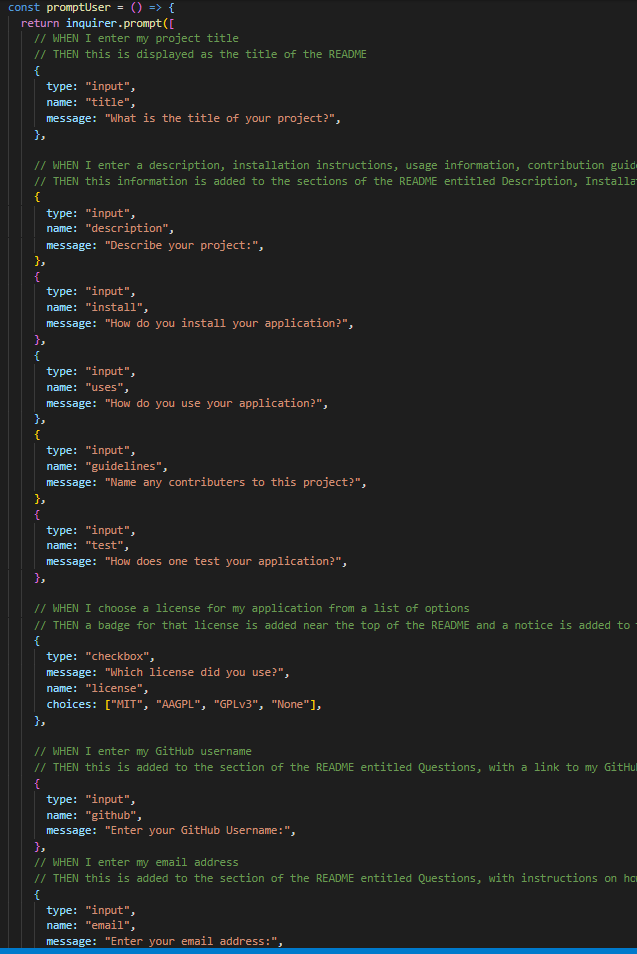
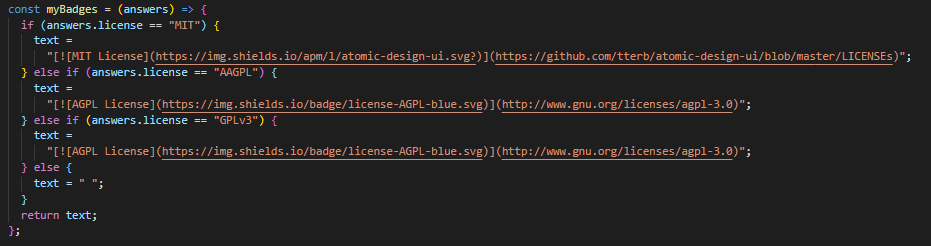

# 09: Readme Generator (Explanation ReadMe)

This is an application to create a readme.md file based on responses from an Inquirer prompt through Node.

Link to Readme: [Generated readme](myreadme.md)

Link to Video: [Readme Generator Walkthrough](https://drive.google.com/file/d/1_SEn_zYHeVgcbJqLoG9IfrV5AKl6Y7Ro/view?usp=sharing)

## 1. Generated Readme

## 2. List of user prompts to build readme

- A. Description, Table of Contents, Installation, Usage, License, Contributing, Tests, and Questions

## 3. License Badge generation

### This project uses: node.js, inquirer package, arrow functions.

## If you have any questions:<a href="mailto:rebuiltrival@gmail.com" hspace="20">Email Me</a>
